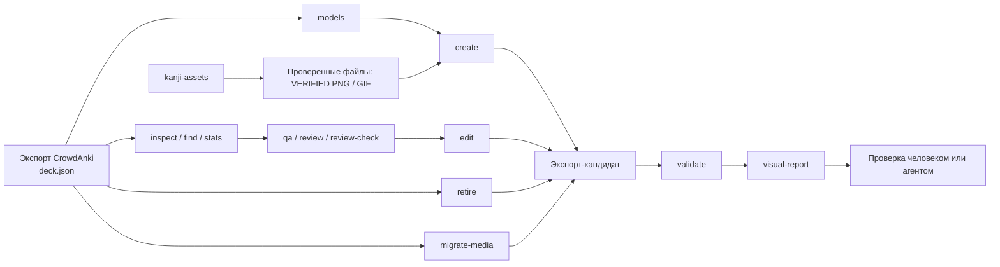

<div align="center">

# Anki-decks

**Колоды Anki как код: версионируемые данные CrowdAnki, детерминированные инструменты на Rust и безопасные рабочие процессы для людей и ИИ-агентов.**

[](https://github.com/AliceLiddell01/Anki-decks/actions/workflows/ci.yml)


[](LICENSE)
[](https://deepwiki.com/AliceLiddell01/Anki-decks)

Версионируемое хранилище Anki-колод и инфраструктура вокруг них: анализ, контроль качества, точечное редактирование, создание заметок, визуальная проверка изменений и управляемые медиафайлы.

[Что умеет](#что-умеет) · [Как это работает](#как-это-работает) · [Быстрый старт](#быстрый-старт) · [Инструменты](#инструменты) · [Структура](#структура-репозитория) · [Лицензия](#лицензия)

</div>

---

## Зачем этот репозиторий

Обычный CrowdAnki-экспорт — это большой JSON, который неудобно безопасно читать, сравнивать и редактировать вручную. Здесь экспорт хранится как **версионируемый исходник колоды**, а операции вокруг него вынесены в детерминированные инструменты.

Главная идея проста:

> **Колоды остаются обычными CrowdAnki-данными, а всё, что можно проверить и автоматизировать, проверяется и автоматизируется вокруг них.**

Репозиторий не привязан к одной конкретной колоде, уровню JLPT, модели заметки или имени поля. Текущий состав `decks/` — данные, а не архитектурный контракт.

## Что умеет

| Возможность | Что происходит |
|---|---|
| **Исследовать экспорт** | `inspect`, `find`, `stats` и `models` дают компактное представление структуры без ручного чтения многомегабайтного `deck.json`. |
| **Проверять целостность** | `validate` проверяет структуру CrowdAnki, идентификаторы, модели, поля, ссылки на медиа и другие инварианты. |
| **Проводить контроль качества и содержательное ревью** | `qa` → `review` → `review-check` превращают большой экспорт в компактные проверяемые пакеты для внешнего агента. |
| **Точечно менять карточки** | `edit` меняет значения существующих полей, `create` добавляет заметки в существующие модели, `retire` выводит заметку из обращения тегом, `migrate-media` переводит доказанные ссылки на медиа на текущее имя домена. |
| **Показывать результат глазами** | `visual-report` строит автономный HTML-отчёт «до / после» с превью карточек по фактическим шаблонам модели. |
| **Работать с изображениями кандзи** | `asset-store` и `kanji-assets` получают, проверяют и публикуют только подтверждённые PNG/GIF кандзи в корпус, которым управляет программа. |
| **Работать с агентами безопасно** | Репозиторий содержит отдельный контекст маршрутизации и навыки, чтобы агент работал через владельцев контрактов, а не угадывал устройство колоды. |

## Как это работает



Инструменты намеренно разделяют **структурную механику** и **содержательное решение**. `anki-repo` не вызывает LLM API и не пытается сам решать, хороший ли перевод или пример у карточки. Он находит нужные данные, проверяет контракты, ограничивает изменения и даёт внешнему агенту или человеку компактные свидетельства.

## Быстрый старт

Требуются Linux и набор инструментов Rust. Минимальная поддерживаемая версия Rust объявлена в корневом `Cargo.toml`; отдельной копии версии в документации нет.

```bash
git clone https://github.com/AliceLiddell01/Anki-decks.git
cd Anki-decks

cargo build --release --workspace
./target/release/anki-repo --help
```

Выберите любой CrowdAnki-экспорт под `decks/` и передайте **каталог экспорта**, а не путь к самому `deck.json`:

```bash
EXPORT=decks/.../<export>

# Что находится в экспорте
./target/release/anki-repo inspect "$EXPORT"

# Структурно ли он корректен
./target/release/anki-repo validate "$EXPORT"

# Какие модели и поля реально существуют
./target/release/anki-repo models "$EXPORT"
```

Получить и проверить изображения кандзи можно отдельным CLI:

```bash
cargo run --locked --bin kanji-assets -- --output json ensure 漢 字
```

Подробные команды и машиночитаемые контракты находятся в профильной документации:

- [`anki-repo` — анализ, контроль качества, ограниченные изменения и визуальный отчёт](tools/anki-repo/README.md)
- [`asset-store` и `kanji-assets` — жизненный цикл ресурсов и проверка](tools/asset-store/README.md)
- [`repository-maintenance` — инвентаризация диска и безопасный GC](tools/repository-maintenance/README.md)

## Инструменты

### `anki-repo`

Основной набор инструментов репозитория для CrowdAnki.

**Не изменяют исходный экспорт:**

`inspect` · `find` · `stats` · `validate` · `qa` · `review` · `review-check` · `models` · `visual-report`

`visual-report` создаёт отдельный каталог отчёта, но не меняет сравниваемые экспорты.

**Могут изменить экспорт только по явному `--apply`:**

- `edit` — меняет значения существующих полей существующих заметок;
- `create` — добавляет новые заметки в уже существующую колоду и модель;
- `retire` — добавляет тег вывода из обращения без физического удаления заметки;
- `migrate-media` — переписывает только доказанные ссылки на прежнее имя домена.

Все изменяющие команды по умолчанию выполняют пробный запуск (`dry-run`), а запись делают только с явным `--apply` после проверок. `edit` и `retire` меняют только `deck.json`. `create` может разместить в `media/` только проверенные файлы из настроенных доменов и добавить нужные объявления `media_files`. `migrate-media` может переписать доказанные ссылки существующих заметок, разместить канонический файл и удалить освобождённый файл со старым именем после публикации `deck.json`.

Пространство `code-review` собирает свидетельства для независимого ревью кода, а его группа `learning` накапливает локальную проверенную историю завершённых ревью в `.anki-repo/learning/state.sqlite` (каталог исключён через `.gitignore`): объяснимые паттерны, локальный поиск аналогий, guardrailed-рекомендации, аудируемую обратную связь, перенос и предложения политики. Отдельную запись можно явно удалить командой `learning forget --review-id ID --confirm`. Это добавочный слой, а не источник семантической истины: он не создаёт замечаний, не меняет `review.json`, `review-queue.json` и `semantic-triage.json`, не выполняет suppression и не применяет политику автоматически, а отсутствие истории не мешает обычному ревью.

[Полный контракт `anki-repo` →](tools/anki-repo/README.md)

### `repository-maintenance`

Отдельный инструмент для Linux/WSL, который учитывает каталоги `target` Cargo,
внешние кэши сборки, принадлежащие проекту, и всё содержимое `/tmp`. `scan` только измеряет, `clean` по умолчанию
показывает пробный запуск (`dry-run`), а запись требует `--apply`. Чужие и неизвестные записи
временного каталога отображаются, но не удаляются.

[Политика, аудит источников, команды и ограничения →](tools/repository-maintenance/README.md)

### `asset-store` / `kanji-assets`

Отдельное хранилище ресурсов, которыми управляет программа. Сейчас предметный CLI работает с изображениями кандзи:

```text
Yarxi
  ↓
  получение
  ↓
  семантическая проверка
  ├─ VERIFIED  ──→ проверенный корпус
  └─ другое    ──→ локальное хранилище текущих данных / карантин
```

Проверенный корпус содержит только подтверждённые ресурсы и сведения об их происхождении. Неподтверждённые кандидаты не публикуются. `asset-store` не сканирует `decks/**/media/` и не использует пользовательские каталоги медиа как источник данных.

[Полный контракт `asset-store` →](tools/asset-store/README.md)

## Создание и визуальная проверка карточки

Типовой безопасный маршрут выглядит так:

```text
models
  ↓
фактическая схема модели
  ↓
create (пробный запуск)
  ↓
create --apply
  ↓
validate
  ↓
visual-report
  ↓
визуальная приёмка
```

Для поля, которому явно разрешены `kanji-assets`, `create` может использовать только изображения, уже подтверждённые через `asset-store`. Схема полей при этом всё равно берётся из фактического экспорта: набор инструментов не считает имя вроде «Слово» или «Ударение» глобальным контрактом.

Разрешение может быть задано и для `pitch-accent`. В обоих случаях правила связывают точные UUID модели и имена полей с конкретным обработчиком домена; произвольные ссылки на медиа остаются запрещёнными. `create` не создаёт колоды или модели и не оценивает лингвистическое содержимое. Для изменения ссылки существующей заметки предназначена только узкая команда `migrate-media`, которая доказывает соответствие идентификатора и старого имени файла, проверяет потребителей в полях заметок и шаблонах модели и блокирует неподтверждённые ссылки.

<details>
<summary><strong>Почему изменения ограничены настолько жёстко?</strong></summary>

`deck.json` — канонический источник колоды, поэтому широкая «удобная» правка здесь опаснее, чем кажется.

- изменяющие команды выполняют пробный запуск (`dry-run`), пока не передан `--apply`;
- существующие идентичности CrowdAnki/Anki не меняются без отдельной причины;
- `create` не создаёт новые модели, поля или колоды;
- `retire` не удаляет заметку физически;
- кандидат перед записью повторно разбирается и проверяется;
- точечные операции стараются доказать, что изменили именно разрешённую поверхность.

Подробные гарантии принадлежат [README набора инструментов](tools/anki-repo/README.md), а не этому обзорному файлу.

</details>

<details>
<summary><strong>Как устроен CI?</strong></summary>

Корневая рабочая область Cargo — единая точка сборки и проверки кода Rust.

```bash
cargo fmt --all --check
cargo clippy --workspace --all-targets --all-features --locked -- -D warnings
cargo test --workspace --all-features --locked
```

GitHub Actions дополнительно:

- проверяет рабочую область Cargo на заявленной MSRV;
- проверяет только подтверждённые ресурсы корпуса кандзи, если корпус присутствует;
- рекурсивно находит фактически закоммиченные CrowdAnki-экспорты под `decks/`;
- запускает `anki-repo validate` для каждого найденного экспорта.

Тесты самодостаточны и не используют пользовательские колоды как тестовые данные.

</details>

<details>
<summary><strong>Что происходит с медиафайлами?</strong></summary>

У репозитория две разные границы владения медиа.

**Медиа конкретной CrowdAnki-колоды** принадлежат самой колоде и её экспорту.

**Ресурсы, которыми управляет программа**, принадлежат `asset-store`. Он не читает пользовательские каталоги медиа колод и ведёт собственные манифесты, контрольные суммы, сведения о происхождении, временное хранилище карантина и проверенный корпус.

Это разделение позволяет проверять и повторно использовать доверенные ресурсы, не превращая пользовательский `media/` в неявную базу данных программы. В каталог `media/` экспорта проверенные данные размещает только `anki-repo`: `create` — по явным правилам домена, а `migrate-media` — после доказательства точного соответствия идентификатора и имени и инвентаризации потребителей. Миграция удаляет старое имя только после публикации нового `deck.json`; ручная правка в обход команды не допускается.

</details>

## Структура репозитория

```text
.
├── decks/                    # версионируемые CrowdAnki-экспорты
├── tools/
│   ├── anki-repo/            # анализ, контроль качества, ограниченные изменения, визуальный отчёт
│   ├── asset-store/          # библиотека ресурсов и kanji-assets
│   └── repository-maintenance/ # инвентаризация и безопасный GC
├── .asset-store/             # ресурсы, которыми управляет программа, если присутствуют
├── .agents/
│   └── skills/               # рабочие процессы для агентов
├── .codex/
│   └── context/              # маршрутизация и долговременный контекст
├── .devin/
│   └── wiki.json             # управляемая конфигурация DeepWiki
├── .github/
│   └── workflows/            # CI
├── AGENTS.md                 # глобальные инварианты работы агентов
├── Cargo.toml                # корневая рабочая область Cargo, `edition` и MSRV
└── Cargo.lock
```

### `decks/` — данные, а не контракт

Состав `decks/` может меняться. Новые колоды могут использовать другие модели, поля и структуру.

Поэтому производственный код, тесты и CI не должны быть привязаны к конкретному уровню JLPT, имени колоды, модели или поля. Инструменты разрешают фактическую схему из самого CrowdAnki-экспорта.

### Агентский контекст

Для работы с помощью ИИ репозиторий содержит отдельную карту владельцев:

- [`AGENTS.md`](AGENTS.md) — глобальные инварианты;
- [`.codex/context/INDEX.md`](.codex/context/INDEX.md) — маршрутизация к профильному контексту;
- [`.agents/skills/`](.agents/skills/) — процедуры репозитория для агентов.

README остаётся обзором проекта. Он не дублирует полные рабочие процессы и архитектурные контракты их владельцев.

## Проверка изменений

Для обычной разработки из корня репозитория:

```bash
cargo fmt --all --check
cargo clippy --workspace --all-targets --all-features --locked -- -D warnings
cargo test --workspace --all-features --locked
```

Для конкретного экспорта:

```bash
./target/release/anki-repo validate <каталог-экспорта>
```

Для корпуса кандзи, если он присутствует:

```bash
cargo run --quiet --locked -p asset-store --bin kanji-corpus-gate
```

## Лицензия

Собственный программный код, автоматизация и настройки репозитория, а также документация проекта распространяются по **лицензии MIT**.

Содержимое `decks/`, пользовательские медиафайлы и сторонние ресурсы или корпуса не получают лицензию MIT автоматически: для них действуют права исходных правообладателей или отдельные условия, если они указаны.

[Полный текст и границы лицензии →](LICENSE)

---

<div align="center">

**CrowdAnki остаётся источником данных. Инструменты вокруг него делают изменения наблюдаемыми, проверяемыми и воспроизводимыми.**

</div>
