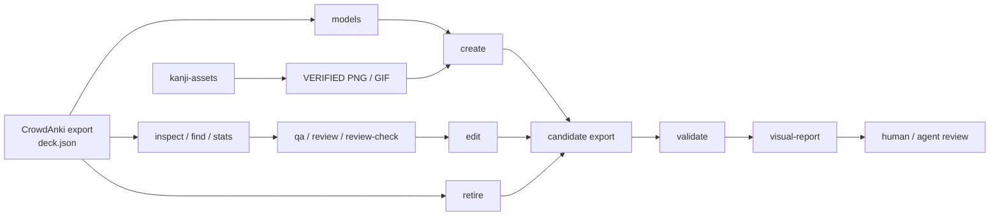

<div align="center">

# Anki-decks

**Anki decks as code: versioned CrowdAnki data, deterministic Rust tooling and safe workflows for humans and AI agents.**

[](https://github.com/AliceLiddell01/Anki-decks/actions/workflows/ci.yml)


Версионируемое хранилище Anki-колод и инфраструктура вокруг них: анализ, QA, точечное редактирование, создание заметок, визуальная проверка изменений и управляемые media-assets.

[Что умеет](#что-умеет) · [Как это работает](#как-это-работает) · [Быстрый старт](#быстрый-старт) · [Инструменты](#инструменты) · [Структура](#структура-репозитория)

</div>

---

## Зачем этот репозиторий

Обычный CrowdAnki-экспорт — это большой JSON, который неудобно безопасно читать, сравнивать и редактировать вручную. Здесь экспорт хранится как **версионируемый исходник колоды**, а операции вокруг него вынесены в детерминированные инструменты.

Главная идея проста:

> **Колоды остаются обычными CrowdAnki-данными, а всё, что можно проверить и автоматизировать, проверяется и автоматизируется вокруг них.**

Репозиторий не привязан к одной конкретной колоде, уровню JLPT, модели заметки или имени поля. Текущий состав `decks/` — данные, а не архитектурный контракт.

## Что умеет

| Возможность | Что происходит |
|---|---|
| **Исследовать экспорт** | `inspect`, `find`, `stats` и `models` дают компактное представление структуры без ручного чтения многомегабайтного `deck.json`. |
| **Проверять целостность** | `validate` проверяет структуру CrowdAnki, идентичности, модели, поля, ссылки на media и другие инварианты. |
| **Проводить QA и содержательный review** | `qa` → `review` → `review-check` превращают большой экспорт в компактные проверяемые batch'и для внешнего агента. |
| **Точечно менять карточки** | `edit` меняет значения существующих полей, `create` добавляет заметки в существующие модели, `retire` выводит заметку из обращения тегом. |
| **Показывать результат глазами** | `visual-report` строит автономный HTML-отчёт «до / после» с превью карточек по фактическим шаблонам модели. |
| **Работать с kanji-assets** | `asset-store` и `kanji-assets` получают, проверяют и публикуют только подтверждённые PNG/GIF кандзи в program-owned corpus. |
| **Работать с агентами безопасно** | Репозиторий содержит отдельный routing-контекст и skills, чтобы агент работал через владельцев контрактов, а не угадывал устройство колоды. |

## Как это работает



Инструменты намеренно разделяют **структурную механику** и **содержательное решение**. `anki-repo` не вызывает LLM API и не пытается сам решать, хороший ли перевод или пример у карточки. Он находит нужные данные, проверяет контракты, ограничивает mutation и даёт внешнему агенту или человеку компактное evidence.

## Быстрый старт

Требуется Linux и Rust toolchain. Минимальная поддерживаемая версия Rust объявлена в корневом `Cargo.toml`; сейчас это **1.88**, edition **2024**.

```bash
git clone https://github.com/AliceLiddell01/Anki-decks.git
cd Anki-decks

cargo build --release --workspace
./target/release/anki-repo --help
```

Выберите любой CrowdAnki-экспорт под `decks/` и передайте **каталог экспорта**, а не путь к самому `deck.json`:

```bash
EXPORT=decks/.../<export>

# Что находится в экспорте
./target/release/anki-repo inspect "$EXPORT"

# Структурно ли он корректен
./target/release/anki-repo validate "$EXPORT"

# Какие модели и поля реально существуют
./target/release/anki-repo models "$EXPORT"
```

Получить и проверить изображения кандзи можно отдельным CLI:

```bash
cargo run --locked --bin kanji-assets -- --output json ensure 漢 字
```

Подробные команды и machine-readable контракты находятся в профильной документации:

- [`anki-repo` — анализ, QA, mutation и visual report](tools/anki-repo/README.md)
- [`asset-store` и `kanji-assets` — asset lifecycle и валидация](tools/asset-store/README.md)

## Инструменты

### `anki-repo`

Главный repository toolkit для CrowdAnki.

**Не изменяют исходный экспорт:**

`inspect` · `find` · `stats` · `validate` · `qa` · `review` · `review-check` · `models` · `visual-report`

`visual-report` создаёт отдельный каталог отчёта, но не меняет сравниваемые экспорты.

**Могут изменить экспорт только по явному `--apply`:**

- `edit` — меняет значения существующих полей существующих заметок;
- `create` — добавляет новые заметки в уже существующую колоду и модель;
- `retire` — добавляет тег вывода из обращения без физического удаления заметки.

Все три mutation-команды работают как dry-run по умолчанию и проверяют кандидат до публикации.

[Полный контракт `anki-repo` →](tools/anki-repo/README.md)

### `asset-store` / `kanji-assets`

Отдельная program-owned граница для media-assets. Сейчас предметный CLI работает с изображениями кандзи:

```text
Yarxi
  ↓
acquisition
  ↓
semantic validation
  ├─ VERIFIED  ──→ canonical corpus
  └─ другое    ──→ local runtime / quarantine
```

Canonical corpus содержит только подтверждённые assets и их provenance. Неподтверждённые кандидаты не публикуются. `asset-store` не сканирует `decks/**/media/` и не использует пользовательские media-каталоги как источник данных.

[Полный контракт asset store →](tools/asset-store/README.md)

## Создание и визуальная проверка карточки

Типовой безопасный маршрут выглядит так:

```text
models
  ↓
фактическая схема модели
  ↓
create (dry-run)
  ↓
create --apply
  ↓
validate
  ↓
visual-report
  ↓
визуальная приёмка
```

Для поля, которому явно разрешены kanji-assets, `create` может использовать только изображения, уже подтверждённые через `asset-store`. Схема полей при этом всё равно берётся из фактического экспорта: toolkit не считает имя вроде «Слово» или «Ударение» глобальным контрактом.

<details>
<summary><strong>Почему mutation ограничены настолько жёстко?</strong></summary>

`deck.json` — канонический источник колоды, поэтому широкая «удобная» правка здесь опаснее, чем кажется.

- mutation-команды работают как dry-run, пока не передан `--apply`;
- существующие идентичности CrowdAnki/Anki не меняются без отдельной причины;
- `create` не создаёт новые модели, поля или колоды;
- `retire` не удаляет заметку физически;
- кандидат перед записью повторно разбирается и проверяется;
- точечные операции стараются доказать, что изменили именно разрешённую поверхность.

Подробные гарантии принадлежат [README toolkit'а](tools/anki-repo/README.md), а не этому обзорному файлу.

</details>

<details>
<summary><strong>Как устроен CI?</strong></summary>

Корневой Cargo workspace — единая точка сборки и проверки Rust-кода.

```bash
cargo fmt --all --check
cargo clippy --workspace --all-targets --all-features --locked -- -D warnings
cargo test --workspace --all-features --locked
```

GitHub Actions дополнительно:

- проверяет workspace на заявленной MSRV;
- запускает verified-only gate для kanji corpus, если corpus присутствует;
- рекурсивно находит фактически закоммиченные CrowdAnki-экспорты под `decks/`;
- запускает `anki-repo validate` для каждого найденного экспорта.

Тесты самодостаточны и не используют пользовательские колоды как fixtures.

</details>

<details>
<summary><strong>Что происходит с media?</strong></summary>

У репозитория две разные media-границы.

**Media конкретной CrowdAnki-колоды** принадлежат самой колоде и её экспорту.

**Program-owned assets** принадлежат `asset-store`. Он не имеет права рыться в пользовательских media-каталогах колод и ведёт собственный manifest, hashes, provenance, runtime quarantine и canonical corpus.

Это разделение позволяет проверять и переиспользовать доверенные assets, не превращая пользовательский `media/` в неявную базу данных программы.

</details>

## Структура репозитория

```text
.
├── decks/                    # версионируемые CrowdAnki-экспорты
├── tools/
│   ├── anki-repo/            # анализ, QA, mutation, visual report
│   └── asset-store/          # asset core + kanji-assets
├── .asset-store/             # canonical program-owned assets, если присутствуют
├── .agents/
│   └── skills/               # repository workflows для агентов
├── .codex/
│   └── context/              # маршрутизация и долговременный контекст
├── .devin/
│   └── wiki.json             # управляемая конфигурация DeepWiki
├── .github/
│   └── workflows/            # CI
├── AGENTS.md                 # глобальные инварианты работы агентов
├── Cargo.toml                # корневой Rust workspace, edition и MSRV
└── Cargo.lock
```

### `decks/` — данные, а не контракт

Состав `decks/` может меняться. Новые колоды могут использовать другие модели, поля и структуру.

Поэтому production-код, тесты и CI не должны быть привязаны к конкретному уровню JLPT, имени колоды, модели или поля. Инструменты разрешают фактическую схему из самого CrowdAnki-экспорта.

### Агентский контекст

Для AI-assisted работы репозиторий содержит отдельную карту владельцев:

- [`AGENTS.md`](AGENTS.md) — глобальные инварианты;
- [`.codex/context/INDEX.md`](.codex/context/INDEX.md) — маршрутизация к профильному контексту;
- [`.agents/skills/`](.agents/skills/) — процедурные repository skills.

README остаётся обзором проекта. Он не дублирует полные workflow и архитектурные контракты их владельцев.

## Проверка изменений

Для обычной разработки из корня репозитория:

```bash
cargo fmt --all --check
cargo clippy --workspace --all-targets --all-features --locked -- -D warnings
cargo test --workspace --all-features --locked
```

Для конкретного экспорта:

```bash
./target/release/anki-repo validate <каталог-экспорта>
```

Для kanji corpus, если он присутствует:

```bash
cargo run --quiet --locked -p asset-store --bin kanji-corpus-gate
```

---

<div align="center">

**CrowdAnki остаётся источником данных. Инструменты вокруг него делают изменения наблюдаемыми, проверяемыми и воспроизводимыми.**

</div>
